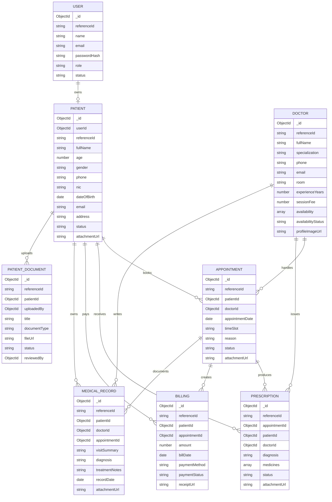

# Database Schema Diagram

MongoDB uses collections and documents. This project uses separate collections for core entities and references them with ObjectIds.

## Design Notes
- MongoDB `_id` remains the real database key used for relationships.
- `referenceId` is a human-friendly display ID for staff and demo use, such as `PAT-0001`, `DOC-0001`, `APT-0001`, `RX-0001`, `BILL-0001`, `MR-0001`, and `STF-0001`.
- Patient login is linked by `Patient.userId`, while admin-created patient records can exist without a login account.
- Patient-uploaded documents are supporting submissions; doctors/admins review them before they are treated as official medical records.
- Medicines are embedded inside `Prescription` because they are always used together with the prescription.
- Patient, doctor, and appointment data are referenced because they are independent modules.
- File metadata is stored in each module document, while actual files are stored in Cloudinary.
