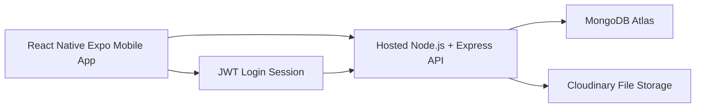

# System Architecture

## Problem Statement
Clinics need a mobile system for staff to manage patients, doctors, appointments, prescriptions, billing, and medical records using a hosted backend and MongoDB database.

## Architecture Diagram


## Runtime Flow
```text
Mobile screen -> mobile service -> Express route -> controller -> Mongoose model -> MongoDB
```

## Hosting
- Backend must be deployed to Render, Railway, AWS, DigitalOcean, or a similar platform.
- Mobile app must use the hosted backend URL through `EXPO_PUBLIC_API_URL`.
- MongoDB Atlas stores database documents.
- Cloudinary stores uploaded files.

## Team Responsibility Breakdown
| Member | Module |
| --- | --- |
| Member 1 | Patient Management |
| Member 2 | Doctor Management |
| Member 3 | Appointment / Receptionist Management |
| Member 4 | Prescription Management |
| Member 5 | Billing Management |
| Member 6 | Medical Records |
| Group | Authentication / User Management |
